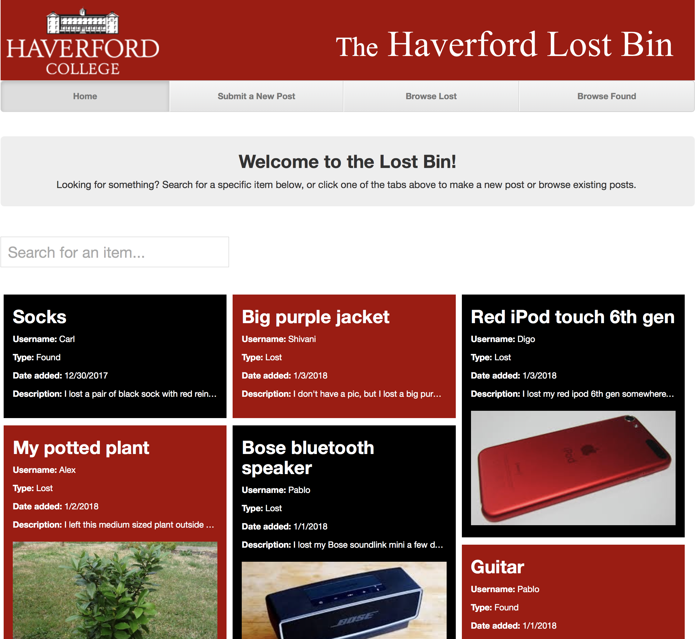

# Haver-Lost-and-Found
A lost and found site for use at Haverford College. ([LINK](http://haverlostandfound-env.4aqm3pzj9q.us-east-2.elasticbeanstalk.com))

The main files of the project are server.js and front-page.html (the latter of which is located in the "pages" folder)

To run the server on your own machine, please follow the instructions below:

USAGE INSTRUCTIONS:
1) Make sure you have node.js installed on your machine (download: https://nodejs.org/en/download/)
2) Download this repository
3) Open the terminal and navigate to the repository folder
4) Install dependencies with npm (type in `npm install`)
5) Run the server (type in `node server.js`)
6) Navigate to http://localhost:8080/ in your web browser to view the webpage! You should see a page like the one in the picture below.

# Preview of the Homepage:

